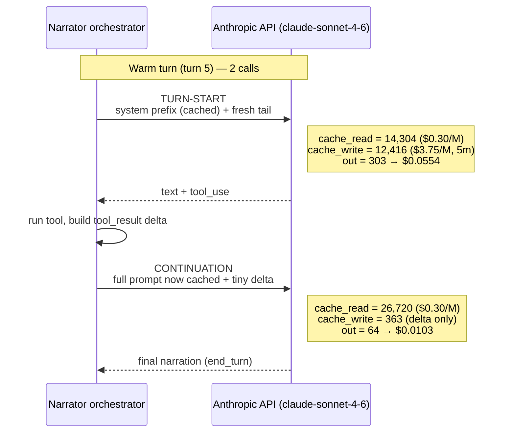
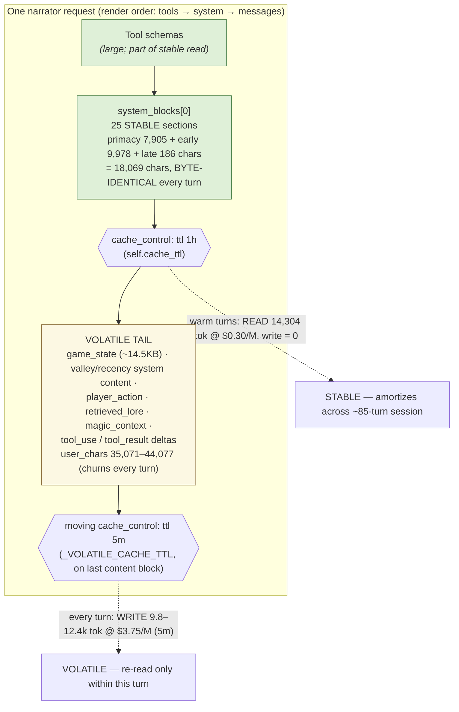
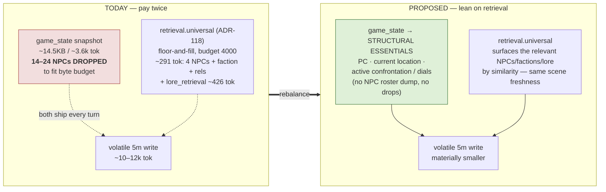

# Narrator Per-Turn Cache-Write Anatomy

**Date:** 2026-06-06
**Author:** Tech Writer (documenting Dev's cost/cache-forensics investigation)
**Audience:** Keith (project owner / senior architect)
**Drive under analysis:** live `2026-06-06-the_circuit`, server `ee03794b`, oq-1 tree
**Data source:** `/tmp/rw_engagement_spans.jsonl` (`narrator.sdk.usage`, `compose`, `prompt.game_state.bytes`, `retrieval.universal`, `watcher.lore_retrieval` spans)
**Model on every call:** `claude-sonnet-4-6` ($3/M in, $15/M out; 5m write 1.25× = $3.75/M; 1h write 2× = $6/M; read 0.1× = $0.30/M)

---

## Executive summary

**The question.** Is the per-turn narrator scene-cache write (~$0.04/turn, ~10–12k tokens) reducible, or is it load-bearing scene freshness?

**The answer.** The write is **already correctly tiered and partitioned** — there is no cheap re-mint to recover and no cache-architecture bug to fix. The stable prefix (`system_blocks[0]` + tool schemas, ~14,304 tokens) is written once at the 1h tier and read at $0.30/M on every warm turn (write = 0); only the genuinely volatile per-turn tail (~9.8–12.4k tokens) is written, and it correctly rides the 5m tier ($3.75/M) because it has zero cross-turn value. Stories 60-3, 60-4, and 61-19 already did this work. **The real leverage for further reduction is not the cache — it is the payload.** The single biggest identifiable chunk of the volatile write is a fat ~14.5KB `game_state` snapshot that ships every turn *and crudely drops NPCs to fit a budget*, while the universal retrieval layer (ADR-118) **already** surfaces the relevant NPCs/factions/lore by embedding similarity for a few hundred tokens. We pay twice. **The strategic fix is to lean on retrieval so the snapshot can shrink to structural essentials. The tactical fix this round is to trim verbosity in the ~34 prompt sections** — lower risk, immediate, independent of the retrieval rebalance.

---

## 1. The per-turn call structure

Each game turn is **2 or 3 narrator SDK calls** under the ADR-102 native tool-use loop:

- **1 TURN-START call** — fresh user content (the player action + newly-composed tail). Identified in spans by `input_tokens = 3`.
- **1–2 continuation calls** — the model emitted a `tool_use`; we ran the tool and fed a `tool_result` delta back. Identified by `input_tokens = 1`.

The verified 12-call log for the 5-turn drive (every call `claude-sonnet-4-6`):

| Turn | Call | cache_read | cache_write | in | out | cost (USD) |
|---|---|---:|---:|---:|---:|---:|
| 1 (COLD) | start | 0 | 24,294 | 3 | 298 | 0.127766 |
| 1 | cont | 24,294 | 506 | 1 | 494 | 0.016599 |
| 2 | start | 14,304 | 9,803 | 3 | 85 | 0.042336 |
| 2 | cont | 24,107 | 720 | 1 | 271 | 0.014000 |
| 2 | cont | 24,827 | 957 | 1 | 588 | 0.019860 |
| 3 | start | 14,304 | 10,975 | 3 | 262 | 0.049386 |
| 3 | cont | 25,279 | 376 | 1 | 383 | 0.014742 |
| 4 | start | 14,304 | 9,950 | 3 | 207 | 0.044718 |
| 4 | cont | 24,254 | 216 | 1 | 88 | 0.009409 |
| 4 | cont | 24,470 | 168 | 1 | 462 | 0.014904 |
| 5 | start | 14,304 | 12,416 | 3 | 303 | 0.055405 |
| 5 | cont | 26,720 | 363 | 1 | 64 | 0.010340 |
| | | | | | **Total** | **0.4195** |

*(Source: `narrator.sdk.usage` spans. The 12-call total of $0.4195 reconciles exactly.)*

**Read this table top-down:**

- Every **warm TURN-START** reads exactly **14,304 tokens** (the stable prefix) and writes **9,803–12,416 tokens** (the fresh volatile tail). `cache_write` ≈ 10–12k is the ~$0.04/turn Keith asked about.
- Every **continuation** re-reads the now-fully-cached prompt (~24–27k) and writes only a tiny delta (**168–957 tokens** — the new `tool_use`/`tool_result` blocks).
- The single **COLD** turn (turn 1, `cache_read = 0`) wrote *everything* (24,294 tokens) — both prefix and tail — because nothing was cached yet. It is the $0.128 outlier.

**The counter-intuitive consequence:** more continuation calls per turn is *cheaper per unit work*, not more expensive. The one-time tail write amortizes over each extra continuation, because continuations re-**read** the tail at $0.30/M instead of **reprocessing** it at full $3/M. A 3-call turn spreads the same tail write across two reads.

---

## 2. The cache partition: stable 1h prefix vs volatile 5m tail

The partition is implemented in `sidequest/agents/anthropic_sdk_client.py`. Two tiers:

- **STABLE prefix** = `system_blocks[0]` + the tool schemas. Marked with `self.cache_ttl` — **1h by default** (`anthropic_sdk_client.py:173–183`; env override `SIDEQUEST_ANTHROPIC_CACHE_TTL`, default `"1h"`). This is the **14,304-token `cache_read` on every warm turn** (write = 0). It amortizes across the ~85-turn session. The 1h tier requires the beta header `extended-cache-ttl-2025-04-11`, sent only on the 1h path (`anthropic_sdk_client.py:129`, `:287–294`).
- **VOLATILE tail** = newest user message + valley/recency system content + the per-iteration `tool_use`/`tool_result` deltas. Marked `_VOLATILE_CACHE_TTL = "5m"` (constant at `anthropic_sdk_client.py:123`). This is the **~10–12k-token `cache_write` per turn**.

**Why 5m and not 1h for the tail?** The tail changes every turn and is re-read only *within the same turn's tool loop* (seconds later). It has **zero cross-turn value**. The 1h tier's 2× write premium only pays off when content persists and is re-read across turns; the 5m tier's 1.25× still covers the within-turn read while never paying the 1h premium. This is documented verbatim in the code comment at `anthropic_sdk_client.py:112–123`.

**The billing data proves the partition by itself.** Reconciling reported costs against Sonnet pricing:

- **Cold turn** (`cw = 24,294`, `cr = 0`, `out = 298`): a *mixed-tier* write of `14,304 @ 1h ($6/M) + 9,990 @ 5m ($3.75/M)` plus output → **$0.127765** vs reported **$0.1277655**. Exact.
- **Warm start** (turn 5: `cr = 14,304`, `cw = 12,416`, `out = 303`): `14,304 read @ $0.30/M + 12,416 written @ 5m $3.75/M` plus output → **$0.055405** vs reported **$0.0554052**. Exact.

A pure-5m or pure-1h model fits *neither* the cold nor the warm number. Only the two-tier split fits both — independent confirmation that the prefix writes at 1h and the tail writes at 5m exactly as the code claims.

**A subtlety worth nailing down.** The 14,304-token stable *read* (≈ 57KB of text) is **much larger than the 18,069-char system block** measured in the `compose` span. The difference is the **tool schemas**, which render at position 0 (before `system`) and are cached together with `system_blocks[0]` under the same prefix. So "stable prefix" = tool schemas + the 25 stable prose sections, not just the visible system text.

### The moving breakpoint (don't re-derive this)

The 5m marker is placed on the **last content block of the newest continuation message** (`complete_with_tools`). Its **presence** is what prevents the prefix from being re-minted at every tool iteration (the Story 60-3 diagnosis); Story 60-4 added the moving breakpoint; Story 61-19 moved *only its TTL* from 1h → 5m. The prefix marker (`system_blocks[0]`) stays at 1h and keeps amortizing. See `anthropic_sdk_client.py:154–172`.

---

## 3. Section → zone map (the centerpiece)

The narrator prompt is assembled from **34 sections** this drive (`compose` span `section_count = 34`; server log `turn.agent_llm.prompt_build section_count` ranged 27–34 over the drive). Assembly: `sidequest/agents/orchestrator.py` (registration) → `sidequest/agents/prompt_framework/core.py` (`compose_split_by_zone`) → `sidequest/game/cookbook/compose.py`.

Two orthogonal classifications apply to every section:

1. **Bucket** (`sidequest/agents/prompt_framework/bucket.py`) — `System` (→ stable 1h prefix) if the name is in `STABLE_SECTION_NAMES` (`bucket.py:28–96`), else `User` (→ volatile 5m tail). This is the cache-relevant axis.
2. **Attention zone** (`Primacy → Early → Valley → Late → Recency`; `prompt_framework/types.py:13–35`) — controls *ordering* within a bucket, not caching.

The 34 sections that fired this drive, mapped against both (verified by parsing `orchestrator.py` `PromptSection.new(...)` calls and cross-referencing `STABLE_SECTION_NAMES`):

| Section | Bucket → cache tier | Zone |
|---|---|---|
| `genre_identity` | **STABLE → 1h prefix** | Primacy |
| `genre_narrator_voice` | **STABLE → 1h prefix** | Primacy |
| `soul_principles` | **STABLE → 1h prefix** | Early |
| `genre_npc_voice` | **STABLE → 1h prefix** | Early |
| `genre_world_state` | **STABLE → 1h prefix** | Early |
| `genre_extraction` | **STABLE → 1h prefix** | Early |
| `genre_keeper_monologue` | **STABLE → 1h prefix** | Early |
| `genre_town` | **STABLE → 1h prefix** | Early |
| `magic_hard_limits` | **STABLE → 1h prefix** | Early |
| `world_context` | **STABLE → 1h prefix** | Early |
| `narrator_vocabulary` | **STABLE → 1h prefix** | Late |
| `genre_transition_hints` | **STABLE → 1h prefix** | Late |
| `game_state` | VOLATILE → 5m tail | Valley |
| `magic_context` | VOLATILE → 5m tail | Valley |
| `active_tropes` | VOLATILE → 5m tail | Valley |
| `retrieved_lore` | VOLATILE → 5m tail | Valley |
| `seed_context` | VOLATILE → 5m tail | Valley |
| `sfx_library` | VOLATILE → 5m tail | Valley |
| `magic_output_rules` | VOLATILE → 5m tail | Primacy |
| `genre_chargen` | VOLATILE → 5m tail | Early |
| `genre_chase_voice` | VOLATILE → 5m tail | Early |
| `genre_combat_voice` | VOLATILE → 5m tail | Early |
| `magic_hard_limits` (dup name guard) | — | — |
| `narrator_available_confrontations` | VOLATILE → 5m tail | Early |
| `opening_directive` | VOLATILE → 5m tail | Early |
| `time_skip_context` | VOLATILE → 5m tail | Early |
| `trope_beat_directives` | VOLATILE → 5m tail | Early |
| `courses` | VOLATILE → 5m tail | Recency |
| `intent_directives` | VOLATILE → 5m tail | Recency |
| `narrator_directives` | VOLATILE → 5m tail | Recency |
| `narrator_verbosity` | VOLATILE → 5m tail | Recency |
| `opening_scene_constraint` | VOLATILE → 5m tail | Recency |
| `player_action` | VOLATILE → 5m tail | Recency |
| `recent_narrative_context` | VOLATILE → 5m tail | Recency |
| `reprompt_directive` | VOLATILE → 5m tail | Recency |

**Net: 12 STABLE / 22 VOLATILE** among the 34 that fired. (The `STABLE_SECTION_NAMES` allowlist contains additional names — `narrator_identity`, `narrator_dialogue`, `output_format`, `narrator_constraints`, `narrator_agency`, `narrator_consequences`, `narrator_pov_rules`, `narrator_referral_rule`, `narrator_output_style` — that are registered through `narrator_prompts` or simply didn't fire on this drive, so they're not in the 34. Flagged rather than guessed.)

**The compose spans confirm the partition is clean:** across all 5 narrator turns the system block was **byte-identical** — `primacy = 7905, early = 9978, late = 186` (total 18,069 chars) every time — while `user_chars` churned (`35,071 / 35,343 / 36,111 / 38,666 / 44,077`). The stable sections are fully promoted to the cache prefix already; **100% of the per-turn variance is in the user/volatile block.**

---

## 4. Tail anatomy — where the 10–12k written tokens come from

The volatile write is dominated by one identifiable chunk. Verified spans (representative turn shown; per-turn range in notes):

| Tail component | Span | Size | Notes |
|---|---|---|---|
| **`game_state` snapshot** | `prompt.game_state.bytes` | **59,015 → 14,488 bytes** (~3.6k tok) | ADR-110 phase A+B slimming (`phase_a_applied`/`phase_b_applied` = true). **`npcs_dropped = 14`**, `room_states_dropped = 0`, `encounter_anchored_count = 0`. The single biggest identifiable chunk of the volatile write. |
| Recency guardrails (already partly removed) | `narrator.recency_guardrails_skipped` | **−5,399 bytes saved** | ADR-111 (partial). Guardrails moved out of the tail: `npc_intro_visual_constraint`, `confrontation_trigger_constraint`, `npc_extraction_constraint`, `location_patch_constraint`. |
| Retrieved lore | `watcher.lore_retrieval` | **3 fragments, 426 tok** | of 26 total fragments — embedding-selected. |
| Recent narrative context | `recent_narrative_context_injected` | **0 → 120 tok** | low early in a session (0, 106, 120 across turns); grows over a long session. |

Per-turn `game_state` varied across the drive: `bytes_after` ranged **14,488–18,391**, `npcs_dropped` **14–24**. The 59,015 → 14,488 figure above is one real turn (the lowest-NPC-drop turn); other turns slimmed from as high as 79,718 bytes and dropped up to 24 NPCs.

**Keep distinct:** `intent_router.state_summary_slimmed` (e.g. 41,106 → 7,817 bytes, `npcs_dropped = 17`) is the **Haiku intent-router's own** summary budget (ADR-113), **not** the narrator tail. Do not conflate the two when attributing cost.

**The headline:** the `game_state` snapshot is the lever. It is ~14.5KB *after* slimming, and it gets there by **dropping 14–24 NPCs** to fit a byte budget. That is a crude truncation, and it is exactly the thing retrieval is supposed to make unnecessary.

---

## 5. The RAG "double-pay" tension (the strategic recommendation)

The universal retrieval layer (**ADR-118**, backed by the lore RAG store **ADR-048**) is **already live and firing every turn**. Verified via `retrieval.universal` spans: `budget_total = 4000`, floor-and-fill selection by embedding similarity. A representative turn selected **6 cards** (4 NPCs + 1 faction + relationships) for `floor_token_cost ≈ 217 + fill_token_cost ≈ 74 ≈ 291 tokens`, plus `watcher.lore_retrieval` selected 3 lore fragments ≈ 426 tokens. Code: `sidequest/game/retrieval_orchestration.py`, `sidequest/game/lore_store.py`.

So we are paying **twice** for NPC/world context on the very same turn:

1. A **fat ~14.5KB `game_state` snapshot** ships in the volatile tail every turn — **and 14–24 NPCs are crudely dropped** from it to fit the byte budget.
2. **Simultaneously**, retrieval **already** surfaces the *relevant* NPCs/factions/lore by embedding similarity for **a few hundred tokens** (~291 + 426).

**The leverage:** lean on retrieval (already paid for) so the fat snapshot can shrink to **structural essentials only** — PC, current location, active confrontation/dials — delivering the *same scene freshness* for far fewer written tokens, instead of dumping the full NPC roster and then crudely truncating it. This is the real reducibility path for the ~$0.04/turn write. ADR-110 phase C (diff-with-anchor) and ADR-112 (prose promotion) are adjacent levers, both currently **deferred/partial**.

---

## 6. Per-turn cost math, reconciled

Volatile tail write band, at Sonnet 5m write rate ($3.75/M):

- 9,803 tok → **$0.0368** · 12,416 tok → **$0.0466** → **~$0.037–0.047 per warm turn** for the tail write alone. (Keith's "~$0.04/turn" is exactly right.)
- Add the prefix read (14,304 × $0.30/M = $0.0043) + output → a warm TURN-START lands at **$0.042–0.055** (matches the table in §1).

**Cold-turn outlier:** turn 1 wrote the entire prompt (prefix @ 1h + tail @ 5m, `cr = 0`) → **$0.128**. This is a one-time, per-session cost, not a per-turn cost. It does not recur as long as turns arrive inside the cache TTL window.

**Drive total reconciliation:** the 12 calls sum to **$0.4195** (5 turns). Of that, the cold turn is $0.128 (31%); the remaining 4 warm turns + 7 continuations are $0.292. Warm TURN-START tail writes ($0.042–0.055 each) are the dominant recurring cost — which is precisely the cost §5's rebalance targets.

---

## 7. What's already optimized — do NOT redo

This work is **done and verified live**. Re-doing it wastes effort and risks regressing a tuned cache:

- **Story 60-3** — diagnosed the prefix re-mint: appended `tool_use`/`tool_result` blocks were forcing a full re-mint of the ~11.7k prefix on every tool iteration. The *presence* of a trailing cache_control marker fixes it.
- **Story 60-4** (2026-05-23) — added the **moving cache_control breakpoint** on the last content block of the newest continuation message. Stopped the per-iteration re-mint. (`anthropic_sdk_client.py:154–159`.)
- **Story 61-19** (2026-05-30) — moved the **tail marker's TTL from 1h → 5m** (`_VOLATILE_CACHE_TTL`, `anthropic_sdk_client.py:123`). The tail is volatile; 1h's 2× premium was wasted on it (~9.7k tok/turn ≈ 73% of session cost per session-894 forensics). **Only the TTL changed — the marker's presence still prevents the prefix re-mint.** The stable prefix stays at 1h and amortizes.
- **Story 61-20** (ADR-112 zone-promotion) — lifted session-static content (`world_context`, `magic_hard_limits`) **out of** the volatile Valley tail **into** the cache-marked system prefix (`bucket.py:77–94`). Written once, read every turn.
- **ADR-110 phase A+B** — `game_state` snapshot slimming is **live** (`phase_a_applied`/`phase_b_applied` = true in spans). The 59KB → 14.5KB reduction is already happening; phase C (diff-with-anchor) is deferred.
- **ADR-111** — recency guardrails partly migrated out of the tail (−5,399 bytes/turn confirmed).

The partition is correct. The tier assignment is correct. The cold turn is unavoidable. **The remaining reducibility is in the payload, not the cache.**

---

## 8. Two-tier recommendation

Clearly separated by horizon and owner:

### STRATEGIC (longer-term — architecture call)
Rebalance toward **proper RAG utilization** (ADR-118 / ADR-048). Shrink the per-turn `game_state` payload to structural essentials (PC, current location, active confrontation/dials) and let the already-live retrieval layer carry the NPC/faction/lore context it *already surfaces by similarity*. This is the structural fix for the ~$0.04/turn write and eliminates the crude NPC-drop truncation. Adjacent deferred levers: ADR-110 phase C (diff-with-anchor), ADR-112 (further prose promotion).

### TACTICAL (this round — Dev-sized)
Trim **prose verbosity** across the ~34 prompt sections — cut wordy/redundant prose, especially in the volatile-tail sections (`game_state` framing, `narrator_directives`, `magic_context`, `retrieved_lore` formatting). This is **not** a cache-architecture change: lower risk, immediate, independent of the RAG rebalance, and it directly shrinks the 5m write that dominates warm-turn cost.

---

## Appendix — sources cited

**Code**
- `sidequest/agents/anthropic_sdk_client.py` — `_VOLATILE_CACHE_TTL` (`:123`), `_EXTENDED_CACHE_TTL_BETA` (`:129`), `cache_ttl` default 1h (`:173–183`), tier rationale (`:112–172`), `complete_with_tools` + moving breakpoint + 1h beta header (`:247–294`).
- `sidequest/agents/prompt_framework/bucket.py` — `STABLE_SECTION_NAMES` (`:28–96`), `default_bucket_for_section` (`:99–108`).
- `sidequest/agents/prompt_framework/types.py` — `AttentionZone` + `order()` (`:13–35`).
- `sidequest/agents/prompt_framework/core.py` — `compose_split_by_zone` (`:195–247`).
- `sidequest/agents/orchestrator.py` — 34 `PromptSection.new(...)` registrations.
- `sidequest/game/retrieval_orchestration.py`, `sidequest/game/lore_store.py` — universal retrieval + lore RAG.

**ADRs** (`/Users/slabgorb/Projects/oq-1/docs/adr/`)
- `048-lore-rag-store.md` — Lore RAG store, cross-process embedding.
- `102-tool-use-protocol-for-structured-output.md` — native tool-use loop (the 2–3 call structure).
- `110-game-state-snapshot-slimming.md` — game_state slimming (phase A/B live, C deferred).
- `111-narrator-guardrails-into-tool-descriptions.md` — recency-guardrail migration (partial).
- `112-genre-prose-stable-cache-promotion.md` — prose promotion to stable prefix (partial).
- `118-universal-retrieval-layer.md` — floor-and-fill per-turn retrieval.

**Spans** — `/tmp/rw_engagement_spans.jsonl`: `narrator.sdk.usage` (12), `compose` (by_zone), `prompt.game_state.bytes`, `intent_router.state_summary_slimmed`, `retrieval.universal`, `watcher.lore_retrieval`, `narrator.recency_guardrails_skipped`, `recent_narrative_context_injected`.
