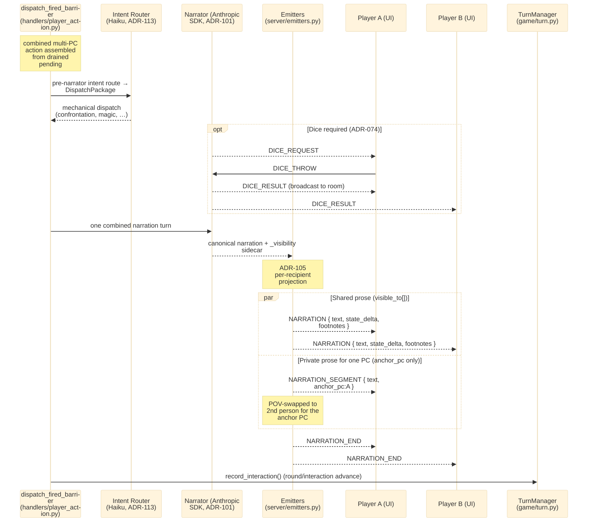
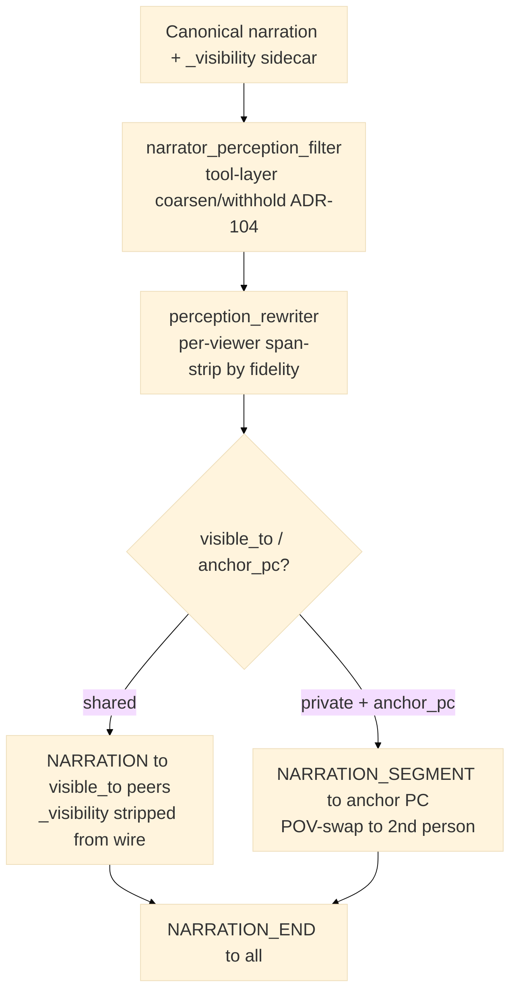

# Multiplayer Submit-and-Wait Turns

> **Last updated:** 2026-06-08 (replaces claim-election/polling/TurnMode model; TurnManager barrier + dispatch_fired_barrier; ADR-105 per-recipient projection; Anthropic SDK narrator)
> *Filename retained as `multiplayer-sealed-turns.md` for stable inbound links; older
> docs may still call this the "sealed letter" pattern. The mechanism is the same:
> all PLAYING peers submit, one narrator call resolves all actions.*
>
> Module paths reference `sidequest-server/sidequest/` (Python). The pre-port Rust
> crate paths in earlier revisions — and the entire claim-election / non-claimer
> polling / `TurnMode` / `SealedRoundContext` / adaptive-timeout model they described —
> have been retired. See `docs/adr/082-port-api-rust-to-python.md`.

## How it works now

Multiplayer turns run on a single barrier inside the per-session `TurnManager`. Each
player's `PLAYER_ACTION` is buffered in the `SessionRoom` and recorded against the
barrier via `TurnManager.submit_input(player_id)` (`game/turn.py:90`). The barrier
holds in the `InputCollection` phase until **every PLAYING peer** has submitted; the
phase then advances to `IntentRouting` and the barrier "fires." Crashed or
disconnected players are dropped from the denominator (Story 67-1) so the barrier
never waits on a submission that will never come — `effective_barrier_count()` is
PLAYING peers minus crash-released awaiters (`handlers/player_action.py:548`).

When the barrier fires, exactly **one** socket is elected to drive the turn. Election
is a compare-and-swap on `SessionRoom.last_dispatched_round` (keyed on the monotonic
`interaction` counter) under `session._room.dispatch_lock`; the winner calls
`dispatch_fired_barrier()` (`handlers/player_action.py:149`), which drains all buffered
pending actions from `SessionRoom._pending_actions`, assembles one combined multi-PC
action, and runs **one** narration via `_execute_narration_turn()`. Losers of the CAS
race return immediately.

There is no claim/non-claim split, no polling loop, no `store_resolution_narration` /
`get_resolution_narration`, no `SealedRoundContext` / `MultiplayerSession` /
`SessionSync`, no `TurnMode` (FreePlay/Structured/Cinematic) enum, and no adaptive
timeout / "hesitates" auto-resolve. The single barrier covers solo and multiplayer
uniformly — a solo room flips the barrier on the first submission and continues into
the dispatch branch with zero extra overhead.

### Phases

Turn phases are tracked by `TurnPhase` (`game/turn.py:25`):
`InputCollection → IntentRouting → AgentExecution → StatePatch → Broadcast`. The
barrier lives at `InputCollection`; `submit_input` advances to `IntentRouting` once
the submitted set reaches the PLAYING player count.

### Peer visibility (ADR-036)

Action text is **peer-visible** during the submission window (collaborative default
per ADR-036 amendment 2026-05-03). As each player types and submits, the server
broadcasts `TURN_STATUS` updates carrying the roster so peers can watch the sealed
strip fill in — `{status:"active", entries:[…]}` at action receipt, then
`{status:"submitted", entries:[…]}` per submission (flipping that player's row from
"Composing…" to "✓ Sealed"). When the last player submits, the roster projects the
terminal all-submitted state. The barrier blocks *resolution*, not *visibility* —
teammates can read each other's typing in real time. Hidden-submission ("sealed
visibility") mode is reserved for PvP scenarios and is not currently implemented; see
the ADR-036 doctrine clarification (2026-05-09).

## Sequence

### Part 1 — Submission & barrier

```mermaid
%%{init: {'theme':'base', 'themeVariables': {'fontSize':'22px'}, 'sequence': {'actorFontSize':22, 'messageFontSize':20, 'noteFontSize':19, 'wrap':true}}}%%
sequenceDiagram
    participant A as Player A (UI)
    participant B as Player B (UI)
    participant H as PlayerActionHandler (handlers/player_action.py)
    participant R as SessionRoom (server/session_room.py)
    participant TM as TurnManager (game/turn.py)

    Note over A,B: InputCollection — barrier holds until all PLAYING peers submit

    A->>H: PLAYER_ACTION { action, player_id }
    H->>R: record_pending_action(A, name, action)
    H->>TM: submit_input(A)
    Note over TM: submitted = {A}, need 2 → still InputCollection
    H-->>A: TURN_STATUS { status:"submitted", entries:[roster] }
    H-->>B: TURN_STATUS { status:"submitted", entries:[roster] }
    H-->>A: return [] (barrier holds)

    B->>H: PLAYER_ACTION { action, player_id }
    H->>R: record_pending_action(B, name, action)
    H->>TM: submit_input(B)
    Note over TM: submitted = {A,B} ≥ 2 → phase IntentRouting (BARRIER FIRES)
    H-->>A: TURN_STATUS { status:"submitted", entries:[all-submitted] }
    H-->>B: TURN_STATUS { status:"submitted", entries:[all-submitted] }
    Note over H: emit mp.barrier_fired

    H->>R: dispatch_lock + CAS on last_dispatched_round
    Note over H: single-dispatcher election; loser returns []
    H->>R: drain_pending_actions() → [A, B]
    Note over H: emit mp.round_dispatched

    par PLAYER_SPEECH for each quoted line (whole party, no firewall)
        H-->>A: PLAYER_SPEECH { character_name, text, round }
        H-->>B: PLAYER_SPEECH { character_name, text, round }
    end

    H->>R: _broadcast_cleared_to_party()
    R-->>A: ACTION_REVEAL { status:CLEARED }
    R-->>B: ACTION_REVEAL { status:CLEARED }
```

### Part 2 — Narration & broadcast



## Perception filtering

Two perception layers are both live, at different stages of the turn:

1. **Narrator tool-layer filter** — `agents/narrator_perception_filter.py` (ADR-104).
   Coarsens or withholds *tool results* before they reach a recipient (e.g. an HP
   query returns a band, not an exact value; a `query_npc` is filtered against the
   asking PC's perspective). This is the firewall at the narration tool boundary, not
   a separate "resonator" agent — the standalone resonator of the pre-port
   architecture no longer exists.

2. **MP fan-out span-strip** — `agents/perception_rewriter.py`. At broadcast time,
   `rewrite_for_recipient(...)` reads the canonical payload's `_visibility.fidelity`
   for each viewer, folds in the viewer's status effects, and drops narration spans
   the viewer cannot perceive (blinded, audio-only, periphery-only, etc.). It emits
   the `narrator.perception_rewrite` span (`agents/perception_rewriter.py:84`) per
   recipient.

The wire delivery itself is per-recipient (ADR-105) in `server/emitters.py`. The
canonical narration carries a `_visibility` sidecar (`visible_to[]`, `fidelity{}`,
`anchor_pc`) that is **stripped from the wire** before send (`emitters.py:152`).
Shared prose goes out as `NARRATION` to everyone in `visible_to[]`; prose private to a
single PC goes out as `NARRATION_SEGMENT { anchor_pc }` to that PC's owning socket
only. When the visibility sidecar names an `anchor_pc` with `pov_strategy ==
"pc_anchored"`, the anchor PC's copy is rewritten into second person via
`agents/pov_swap.py`. A `NARRATION_END` then goes to all recipients.



## Key Files

| File | Purpose |
|------|---------|
| `sidequest-server/sidequest/server/session_room.py` | `SessionRoom` — pending-action buffer, `dispatch_lock`, `last_dispatched_round` CAS, `effective_barrier_count`, broadcast |
| `sidequest-server/sidequest/game/turn.py` | `TurnManager.submit_input` barrier (`:90`), `TurnPhase`, `recheck_barrier` (Story 67-1), `record_interaction` |
| `sidequest-server/sidequest/handlers/player_action.py` | `PLAYER_ACTION` inbound handler, barrier submit + TURN_STATUS broadcast; `dispatch_fired_barrier` (`:149`) drains + narrates |
| `sidequest-server/sidequest/handlers/action_reveal.py` | Peer action-text reveal dispatch (`ACTION_REVEAL` composing/submitted, collaborative visibility per ADR-036 amendment 2026-05-03) |
| `sidequest-server/sidequest/server/emitters.py` | ADR-105 per-recipient projection — `NARRATION` / `NARRATION_SEGMENT` / `NARRATION_END`, `_visibility` egress-strip (`:152`) |
| `sidequest-server/sidequest/agents/perception_rewriter.py` | MP fan-out per-viewer span-strip by fidelity; emits `narrator.perception_rewrite` (`:84`) |
| `sidequest-server/sidequest/agents/narrator_perception_filter.py` | Narrator tool-layer perception firewall (ADR-104) |
| `sidequest-server/sidequest/agents/pov_swap.py` | Second-person POV rewrite for the anchor PC; `extract_spoken_lines` for `PLAYER_SPEECH` |
| `sidequest-server/sidequest/server/dispatch/sealed_letter.py` | Sealed-letter dispatch for **dogfight / confrontation outcomes** — NOT the turn barrier |

> Persistence is PostgreSQL (ADR-115); the per-session SQLite store is retired. The
> narrator backend is the Anthropic Python SDK (ADR-101) with a pre-narrator Intent
> Router (Haiku, ADR-113) — not the `claude -p` subprocess.

## OTEL Events

| Event | Source | When |
|-------|--------|------|
| `mp.barrier_fired` | `handlers/player_action.py:631` | The submission that completes the barrier (advances off InputCollection) |
| `mp.round_dispatched` | `handlers/player_action.py:201` | Elected dispatcher drains the buffer and assembles the combined action |
| `action_reveal.composing` | `handlers/action_reveal.py:125` | A peer is mid-compose (live typing reveal) |
| `action_reveal.submitted` | `handlers/action_reveal.py:137` | A peer's action text is sealed/submitted |
| `action_reveal.cleared` | `handlers/player_action.py:90` | Sealed strip cleared at barrier-fire (or on disconnect) |
| `narrator.perception_rewrite` | `agents/perception_rewriter.py:84` | Per-recipient fan-out fidelity span-strip |

> The old `sealed_round.*`, `multiplayer.narration_broadcast`, and `barrier.resolved`
> spans are gone or dead. `barrier.resolved` is still *defined* as
> `SPAN_BARRIER_RESOLVED` (`telemetry/spans/barrier.py:8`) but has **no production
> emit site** — it is referenced only in tests. Do not treat it as a live signal.
