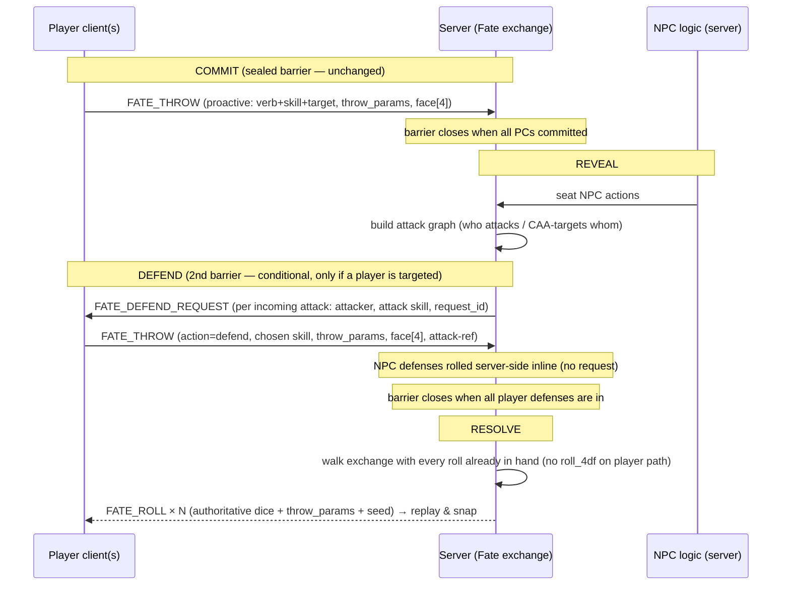

# Determinative Fate (4dF) Rolls — Physics-Is-The-Roll for Players, Server-Side for NPCs

**Date:** 2026-06-17
**Author:** The Man in Black (Architect) + Keith Avery
**Status:** Approved (design) — pending written-spec review
**Epic:** 126 (Fate Core playtest follow-ups)
**Stories:** 126-7 (proactive determinism) + 126-8 (defend follow-up barrier) — split per packaging decision
**Companion ADRs:** ADR-148 (proactive determinism, written) · ADR-149 (defend follow-up barrier — to be authored in 126-8)
**Reconciles:** ADR-074 (dice resolution protocol) · ADR-144 (Fate Core binding) · ADR-036 / ADR-129 (sealed-commit turn model)

---

## 1. Problem

The Fate 4dF path is backwards relative to the d20 path. The **d20** path is
**physics-is-the-roll** (ADR-074, as amended 2026-05-02): the rolling player's client
runs Rapier locally, reads the settled faces, and sends them as the authoritative result;
the server resolves from those faces and never rolls its own RNG for a player.

The **Fate** path inverts this. The player submits intent only (`FateActionPayload` — verb,
skill, target; **no dice**). The server rolls the dice (`roll_4df(random.Random())`),
decides the outcome, and broadcasts `FATE_ROLL`. The 3D `FateDiceTray` is a **post-hoc
decoration** that animates an already-decided result with an `onAllSettle` no-op.

Story 125-4 tried to make that decoration *look* like the roll. It could not: the
synthesized throw lands on physics-determined faces unrelated to the server's decided
result, so the 3D dice can **contradict the text readout**. That defeats the legibility
mandate (Sebastien/Jade: "the dice should show what was actually rolled"). The agent
attempting the fix misjudged it twice — hence design-first.

The root cause is the **direction of authority**, not the animation. When the faces come
**from** the physics throw, replaying `throw_params + seed` reproduces them for every seat
— exactly what "mirror DICE_RESULT" in the 125-4 / 118-x ACs actually required.

## 2. The hard part is Fate's turn structure, not the dice

A player's **proactive** action (overcome / create_advantage / attack) is a clean d20
mirror: my four dF + my skill vs. a number, I throw, the faces are the roll. That drops in
with no friction.

The difficulty is **opposed, reactive rolls**. In Fate an attack is rolled against the
defender's *defend* roll, not a static DC — and the defender often doesn't know they're a
target until the attacker acts. Our engine resolves a Fate round as a **sealed-commit
exchange** (ADR-036 / ADR-129): everyone commits blind and simultaneously, the barrier
closes, NPC actions are seated, then the exchange walk resolves everything. So by the time
an NPC's attack on a player is resolved, that player **already committed and the barrier
is closed** — there is no interactive window for them to physically throw a defense die.

d20 never hits this: every d20 roll here is single-actor against a static DC, with the
roller present at resolution. Fate's reactive second-party rolls collide with the
sealed-commit barrier.

**Decision: keep the sealed-commit barrier (non-negotiable — it protects table pacing,
ADR-036 / Alex), and make the reactive defense a follow-up roll inside a new conditional
DEFEND phase.**

## 3. The full model — a 4-phase round

`run_fate_exchange` stops being a single batch walk and becomes four checkpoints. DEFEND
is **conditional**: skipped entirely in rounds where no player is targeted.

Each phase is a clean **resume checkpoint** — there is never a half-resolved walk to
persist (contrast: a pause-resume coroutine, rejected for exactly this reason).

## 4. Messages (protocol)

| Message | Dir | Role |
|---|---|---|
| **`FATE_THROW`** (new, `FateThrowPayload`) | client→server | **All** player physics rolls — proactive *and* defend. `action` ∈ {overcome, create_advantage, attack, **defend**}, skill, target/attack-ref, invoke fields, `throw_params: ThrowParams`, `face: tuple[int,int,int,int]`. Faces authoritative at the wire: `extra="forbid"`, exactly 4, each ∈ {−1,0,1}. In the `GameMessage` union. |
| **`FATE_DEFEND_REQUEST`** (new, `FateDefendRequestPayload`) | server→client | "You are attacked by X with skill Y — defend." Carries attacker, attack skill/context, and a `request_id` the client echoes in the defend `FATE_THROW`. This is ADR-074's dormant *server-requests-a-throw* path, now used for real. One per incoming attack on a player. |
| **`FATE_ROLL`** (existing) | server→all | Broadcast per resolved roll (action **and** defense): authoritative `dice` + echoed `throw_params` + server `seed`. Spectators replay + **snap to authoritative `dice`** — 3D dice can never contradict the readout. |
| **`FATE_ACTION`** (existing) | client→server | Retained for the **non-roll** verbs only: concede, compel_accept, compel_refuse. Never mounts a tray, never produces `FATE_ROLL`. |

**Why `FATE_THROW` is a distinct message, not optional dice on `FATE_ACTION`:** an
optional `face` field would be a silent fallback (No Silent Fallbacks) — an empty `face`
on a player roll would re-open the server-rolls-for-players backdoor we are deleting. A
faces-required message makes the player-thrown contract unforgeable.

**Seed authority:** the **server** generates the replay `seed` (`generate_dice_seed`) and
echoes it on `FATE_ROLL`. The client sends `throw_params` + `face` only — faithful to
`DiceThrowPayload` (the thing we mirror), which has no client seed. (Recorded as a
deliberate refinement of the AC wording in ADR-148.)

## 5. Server resolution

`game/ruleset/fate_resolution.py` factors classify/build into one private
`_build_outcome(dice, …)`, consumed by two siblings:

- `resolve_action(*, skill_rating, opposition, rng, invoke_bonus)` — **NPC path**, rolls
  `roll_4df(rng)` (unchanged).
- `resolve_action_from_faces(*, skill_rating, opposition, faces, invoke_bonus)` — **player
  path** (actions *and* defenses), never touches an `rng`.

`FateRulesetModule` gains a `resolve_action_from_faces` wrapper emitting the same span.
`_resolve_attack` compares attacker shifts vs. defender shifts exactly as today — the only
change is the defender's faces come from the DEFEND-phase throw (player) or `roll_4df`
(NPC). **The Fate ladder math (`classify_outcome`, shifts, tiers) is untouched** — per
SOUL "Bind the Ruleset, Don't Balance It," we change the dice *source*, never the
resolution.

## 6. UI (sidequest-ui + ../dice-lib — reuse, don't reinvent)

- The dF `DieKind` already exists (`dieRegistry.ts`, `dF.ts` `readDFValue`, procedural
  glyphs incl. the 125-4 `0` label). `DiceScene` reads any registered kind generically —
  no dice-lib change needed beyond consuming it.
- **Proactive:** thrower mode in the Fate tray — copy the
  `DiceOverlay.handleSettle → onThrow(wireParams, faces)` pattern; submit `FATE_THROW` on
  settle. Roll verbs mount the tray and defer the send until settle; non-roll verbs send
  `FATE_ACTION` synchronously as today.
- **Reactive:** on `FATE_DEFEND_REQUEST`, mount the tray in **defend mode** with a
  defense-skill picker → player picks skill, throws, submits `FATE_THROW(action=defend)`
  echoing the `request_id`.
- **Spectators:** existing `FateDiceTray` replay path, snapping to authoritative `dice`.
- **Preserve 125-4:** `throw_params`/`seed` on `FateRollPayload`; dF `0` label. No revert.

## 7. OTEL (the lie detector)

- `fate.action_resolved` gains `source ∈ {player_thrown, server_rolled}` **and**
  `role ∈ {action, defense}`.
- New `fate.defend_phase` span: who was requested, who responded — so the GM panel can
  confirm the DEFEND barrier actually fired and wasn't improvised.
- Span assertions, not source-text greps (No Source-Text Wiring Tests).

## 8. Decisions on the edge cases

- **Per-attack defense, player picks skill (Q1).** One defense throw per incoming attack;
  the player chooses the defense skill each time (Athletics vs. a blade, Will vs. a hex).
  Faithful to Fate and aligned with the engine (it already defends per-attack). Per-attack
  throws nest inside the single DEFEND barrier — a heavily-targeted player throws a couple
  of times within it.
- **AFK in DEFEND: block-and-wait.** Identical to the existing commit barrier
  (submit-and-wait; never rush Alex; No Silent Fallbacks — no quiet server-roll for an
  absent player). A timeout/auto-resolve would be a deliberate future feature, not baked
  in now.
- **Invokes on defense: in scope.** Same mechanism as proactive — bonus = +2 applied to
  the reported faces; reroll = the client throws again and submits the new faces (the
  server never rerolls on a player path; it does the fate-point/aspect accounting only).
  `FATE_THROW` already carries the invoke fields.

## 9. Implementation split

The design above is the whole model. It ships as two stories:

### 126-7 — Player proactive 4dF roll is determinative (~5pt, ADR-148)
- `FATE_THROW` message + `FateThrowPayload` (roll verbs); `resolve_action_from_faces`;
  `dispatch_fate_action` resolves the player's proactive action from reported faces;
  `FateThrowHandler`; thrower-mode Fate tray; `source` OTEL attr. NPC + player-defense
  rolls stay server-side. **Fixes the visible 125-4 contradiction for the common case.**
- `FATE_ACTION` keeps the non-roll verbs. 125-4 groundwork preserved.

### 126-8 — Fate defend follow-up barrier (~8pt, ADR-149)
- Restructure `run_fate_exchange` into COMMIT → REVEAL → DEFEND → RESOLVE.
- `FATE_DEFEND_REQUEST` (server→client) + the DEFEND barrier (parallel, conditional,
  block-and-wait); `FATE_THROW(action=defend)` consumed into `_resolve_attack`; player
  defense via `resolve_action_from_faces`; NPC defense stays `roll_4df`.
- Defend-mode UI (skill picker); `role=defense` + `fate.defend_phase` OTEL.
- Resume-safety across the new phases (ADR-128).

126-7 is independently shippable and de-risks the harder turn-structure change in 126-8.

## 10. Testing (both stories)

- **Determinism:** player path resolves from reported faces; assert `roll_4df` is **not**
  called on the player path (spy). Faces → expected roll_total/ladder_total/shifts/tier.
- **Wire validation:** `FateThrowPayload` rejects ≠4 faces, faces ∉ {−1,0,1}, extra fields.
- **NPC server-side:** opponent + NPC defense still call `roll_4df`; `FATE_ROLL` carries
  synthesized throw_params + seed.
- **Spectator consistency:** replay `throw_params+seed` snaps to authoritative `dice`.
- **OTEL:** `fate.action_resolved` fires with the right `source`/`role`; (126-8)
  `fate.defend_phase` fires. Span assertions.
- **WIRING (mandatory):** end-to-end `FATE_THROW` → real handler/registry → resolve →
  `FATE_ROLL` round-trip on a fixture snapshot (not a unit stub). (126-8) end-to-end
  NPC-attacks-player → `FATE_DEFEND_REQUEST` → player defend throw → resolve, all through
  the real exchange; confirm NPC path still server-rolls.

## 11. Non-goals

- Abandoning the sealed-commit barrier for sequential initiative (explicitly rejected).
- Interactive defense timeouts / auto-resolve (future, if ever).
- Changing any Fate resolution math (bind, don't balance).

## References

- ADR-074 Dice Resolution Protocol — physics-is-the-roll (amended 2026-05-02)
- ADR-144 Fate Core Binding Replaces the Native Ruleset
- ADR-036 Multiplayer Turn Coordination · ADR-129 N-Seat Table Engine (sealed-commit)
- ADR-128 Trope Temporal Governor — resume-safe randomness (resume-safety precedent)
- ADR-148 Player Fate Rolls Are Physics-Is-The-Roll (proactive; this doc's companion)
- Story 125-4 FateDiceTray throw_params/seed + dF '0' label (groundwork preserved)
